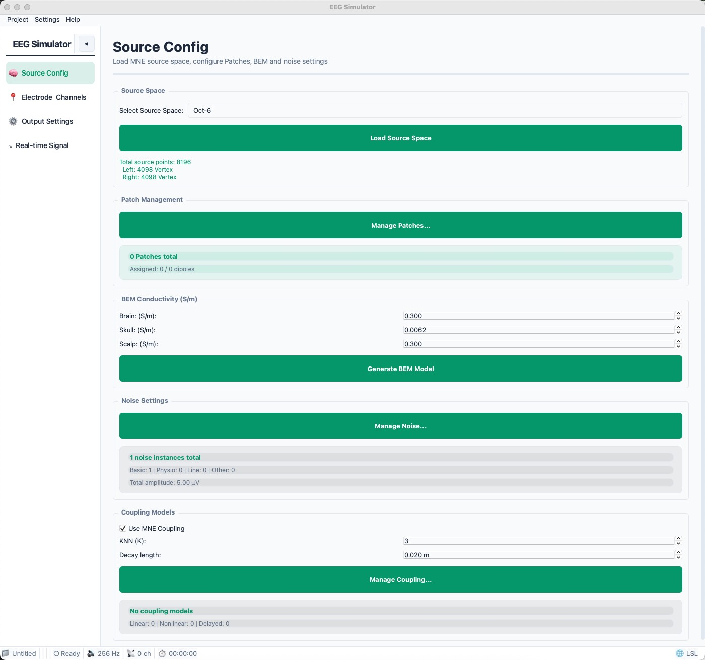
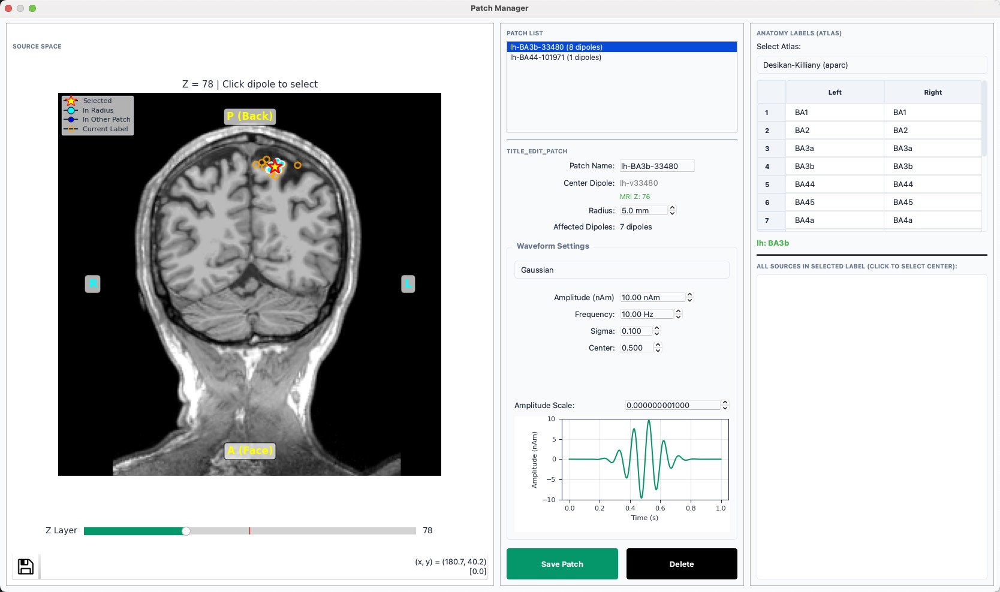
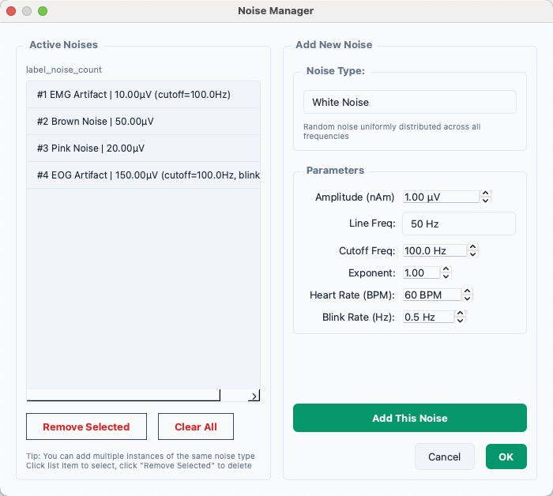
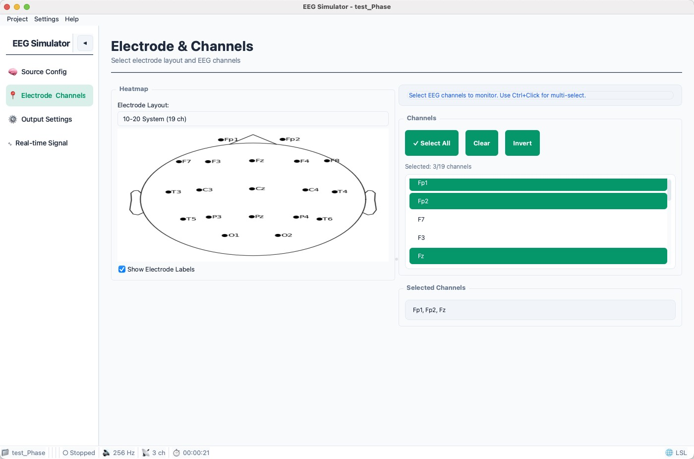
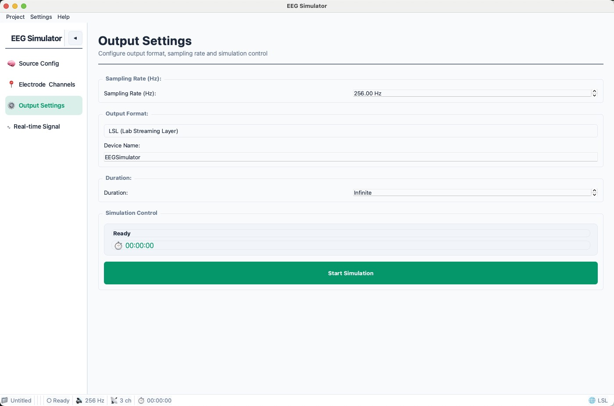
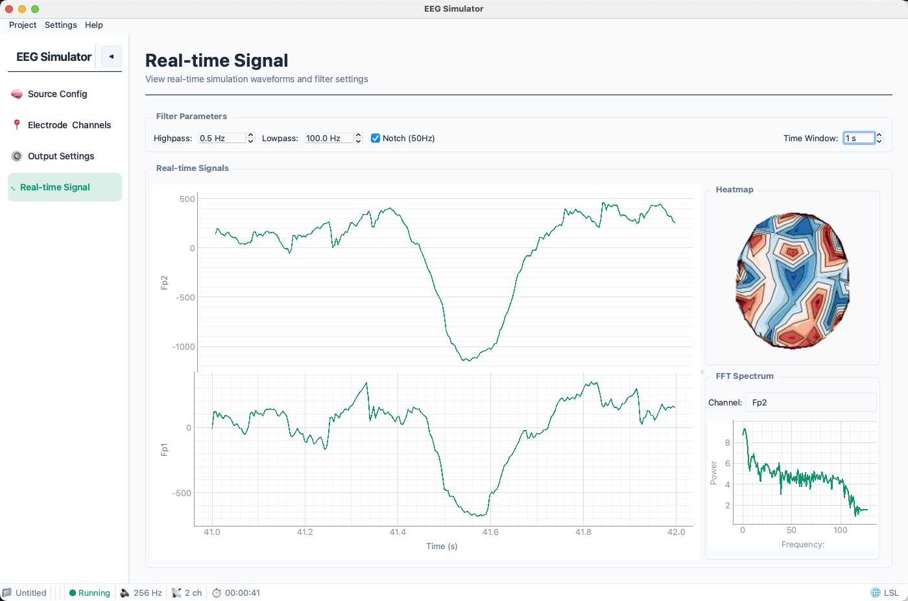

# EEG Simulator | 脑电信号仿真器

[](https://www.python.org/)
[](https://www.riverbankcomputing.com/software/pyqt/)
[](https://mne.tools/)
[](LICENSE)

基于 **PyQt6** 和 **MNE-Python** 的脑电信号仿真平台，支持从真实大脑模型加载源空间，可视化选择信号源，配置偶极子、信号生成器和耦合模型，实现实时脑电信号仿真。

[English Documentation](README_EN.md)

---

## ✨ 功能特点

| 功能 | 描述 |
|------|------|
| 🧠 **真实脑模型** | 加载 MNE 标准大脑模型（如 sample 数据集），支持 MRI 切片可视化 |
| 🎯 **可视化源点选择** | 在 MRI 切片上手动选择，或按解剖标签（Atlas）批量选择信号源 |
| 📊 **灵活的信号配置** | 支持正弦波、方波、锯齿波、脉冲、噪声等多种信号类型 |
| 🔗 **耦合模型** | 定义偶极子之间的连接关系（线性/非线性/延迟耦合）|
| 🔊 **噪声管理** | 支持白噪声、粉红噪声、1/f 噪声、生理噪声（EOG/EMG/ECG）等 |
| 📁 **项目管理** | 创建、保存、加载完整的仿真项目配置 |
| 🎨 **现代化 UI** | 支持深色/浅色主题切换，中英文界面 |
| ⚙️ **BEM 模型** | 设置脑组织、颅骨、头皮的导电率并生成 BEM 模型 |

---

## 📁 项目结构

```
EEG_Simulation/
├── eeg_simulator/                 # 主程序包
│   ├── core/                      # 仿真核心
│   │   ├── simulator/             # 主仿真器（组合式服务模块）
│   │   │   ├── app.py             # EEGSimulator 主类
│   │   │   ├── simulation.py      # 启停与主循环
│   │   │   ├── buffers.py         # 信号缓冲区
│   │   │   └── ...                # UI / 项目 / MNE / Patch 等
│   │   ├── simulator_nav.py       # 向后兼容 re-export
│   │   ├── output_sink.py         # LSL / EDF / FIF 输出
│   │   ├── signal_engine.py       # 信号生成引擎
│   │   └── mne_simulator.py       # MNE 集成仿真器
│   ├── models/                    # 数据模型
│   │   ├── patch.py               # Patch 模型（偶极子组管理）
│   │   ├── coupling.py            # 耦合模型
│   │   ├── mne_coupling.py        # MNE 耦合引擎
│   │   └── signal.py              # 信号生成器
│   ├── ui/                        # 用户界面
│   │   ├── styles.py              # QSS 样式
│   │   ├── themes.py              # 主题管理（深色/浅色）
│   │   ├── widgets/               # 基础控件
│   │   ├── panels/                # 配置面板
│   │   └── dialogs/               # 对话框
│   ├── utils/                     # 工具模块
│   │   ├── config_manager.py      # 配置管理（SQLite）
│   │   ├── project_manager.py     # 项目管理
│   │   ├── mne_loader.py          # MNE 数据加载
│   │   ├── i18n.py                # 国际化
│   │   └── logger.py              # 日志管理
│   ├── __init__.py
│   └── __main__.py                # 模块入口
├── tests/                         # 测试模块
├── main.py                        # 启动脚本
├── requirements.txt               # 依赖列表
└── README.md                      # 本文件
```

---

## 🚀 快速开始

### 环境要求

- Python 3.8+
- Windows / Linux / macOS
- 4GB+ 内存（推荐 8GB）

### 安装

```bash
# 1. 克隆仓库
git clone <repository-url>
cd EEG_Simulation

# 2. 创建虚拟环境（推荐）
python -m venv .venv

# Windows
.venv\Scripts\activate

# Linux/macOS
source .venv/bin/activate

# 3. 安装依赖
pip install -r requirements.txt

# 4. 下载 MNE Sample 数据集（首次运行自动下载）
python -c "import mne; mne.datasets.sample.data_path()"
```

### 启动程序

```bash
# 方式1：使用启动脚本
python main.py

# 方式2：使用模块方式
python -m eeg_simulator
```

---

## 📖 使用指南

### 基本工作流程

```
┌─────────────┐    ┌─────────────┐    ┌─────────────┐    ┌─────────────┐
│  加载源空间  │ -> │  选择信号源  │ -> │  配置信号   │ -> │  运行仿真   │
└─────────────┘    └─────────────┘    └─────────────┘    └─────────────┘
```

#### 1. 加载源空间
- 点击 **"加载 MNE Sample 源空间"** 加载示例数据
- 或点击 **"从文件加载源空间"** 加载自定义 `-src.fif` 文件

<p align="center">
  
</p>

#### 2. 选择信号源
- 点击 **"选择源空间点..."** 打开 MRI 切片可视化选择器
- 在 MRI 切片上点击选择单个点（绿色=左脑，红色=右脑，黄色星形=已选中）
- 或在 **"解剖学标签"** 中勾选区域，批量添加选中区域的全部源点

<p align="center">
  
</p>

#### 3. 配置信号
- **Patch 管理**：创建和管理 Patch（相邻偶极子组）
- **信号生成器**：为正弦波、ERP、Gamma 等信号配置参数
- **耦合模型**：定义 Patch 之间的线性/非线性/延迟连接
- **噪声设置**：添加白噪声、生理噪声等

<p align="center">
  
</p>

#### 4. 设置 BEM 模型（可选）
- 设置脑组织、颅骨、头皮的导电率
- 点击 **"生成 BEM 模型"**

#### 5. 开始仿真
- 设置采样率（默认 1000 Hz）
- 选择要显示的 EEG 通道

<p align="center">
  
</p>

- 配置输出格式与仿真控制

<p align="center">
  
</p>

- 点击 **"开始仿真"** 查看实时波形

<p align="center">
  
</p>

---

## 🔧 核心概念

### Patch 模型

**Patch** 是 EEG 信号仿真的核心抽象，表示大脑中的一个功能区域：

- 包含一个**中心偶极子**（anchor）和相邻偶极子
- 所有偶极子共享相同的**波形设置**
- 支持多种波形类型：正弦波、ERP、Gaussian、Gamma 振荡等

```python
from eeg_simulator.models import Patch

# 创建 Patch
patch = Patch(
    id="patch_1",
    label_name="superiortemporal-lh",
    hemi="lh",
    waveform_type="sin",
    waveform_params={"frequency": 10, "amplitude": 10}
)
```

### 耦合模型

定义 Patch 之间的信号连接关系：

| 耦合类型 | 公式 | 说明 |
|---------|------|------|
| 线性耦合 | `target += strength * source` | 直接信号传递 |
| 非线性耦合 | `target += strength * tanh(source)` | 饱和非线性 |
| 延迟耦合 | `target += strength * source(t-delay)` | 时延连接 |

### 信号类型

| 类型 | 说明 | 参数 |
|------|------|------|
| Sine | 正弦波 | frequency, amplitude, phase |
| ERP | 事件相关电位 | frequency, latency, width |
| Gaussian | 高斯调制 | frequency, sigma, center |
| Gamma | Gamma 振荡 | frequency, alpha, beta |

---

## 🔊 噪声管理

系统支持多种噪声类型，可叠加多个噪声实例，模拟真实 EEG 环境中的各种干扰。

### 噪声类型

| 类型 | 说明 | 可配置参数 |
|------|------|-----------|
| **White** | 白噪声（平坦频谱）| 幅度、截止频率 |
| **Pink** | 粉红噪声（1/f 频谱）| 幅度 |
| **1/f** | 分数噪声 | 幅度、指数 |
| **Brown** | 布朗噪声（1/f² 频谱）| 幅度 |
| **Line** | 工频干扰 | 幅度、频率（50/60 Hz）|
| **EOG** | 眼电伪迹 | 幅度、截止频率、眨眼频率 |
| **EMG** | 肌电伪迹 | 幅度、截止频率 |
| **ECG** | 心电伪迹 | 幅度、心率（BPM）|

#### 生理噪声详解

**ECG (心电伪迹)**
- 模拟心电图波形，包含 P 波、QRS 复合波、T 波
- 使用简化的生理模型，基于心率生成周期性心跳信号
- 典型幅度：20-50 μV
- 适用于模拟心跳对 EEG 的干扰

**EOG (眼电伪迹)**
- 模拟眨眼和眼动产生的低频瞬态干扰
- 眨眼波形：快速上升后缓慢下降的双相脉冲
- 眨眼频率可配置（默认 0.5 Hz，约每2秒一次）
- 包含慢速眼动基线漂移（0.1-0.5 Hz）
- 典型幅度：50-200 μV（眨眼伪迹通常较强）

**EMG (肌电伪迹)**
- 模拟肌肉活动产生的高频非周期性噪声
- 多频带合成：10-30 Hz（大运动单位）、30-100 Hz（主要能量）、100-200 Hz（快速运动单位）
- 模拟爆发性活动（肌肉收缩期）
- 典型幅度：10-30 μV

### 噪声频谱特性详解

| 噪声类型 | 功率谱密度 | 频谱特征 | 生成方法 |
|---------|-----------|---------|---------|
| **白噪声** | $P(f) = C$ | 平坦频谱 | 纯随机序列 |
| **粉红噪声** | $P(f) = C/f$ | 1/f 衰减 | 白噪声积分 |
| **布朗噪声** | $P(f) = C/f^2$ | 1/f² 衰减 | 白噪声双重积分 |
| **1/f 噪声** | $P(f) = C/f^\alpha$ | α 可调衰减 | 分数积分滤波 |

#### 白噪声 (White Noise)

**频谱特征**：**平坦** (Flat Spectrum)，所有频率成分能量相同

| 属性 | 说明 |
|------|------|
| **物理含义** | 类似白光包含所有颜色，各频率能量相等 |
| **听起来** | 嘶嘶声，类似电视雪花 |
| **EEG 意义** | 模拟电子热噪声、量化噪声 |

**FFT 图像**：近似水平直线

#### 粉红噪声 (Pink Noise)

**频谱特征**：**1/f 衰减**，每倍频程能量相等

| 属性 | 说明 |
|------|------|
| **物理含义** | 低频能量高，高频能量低，能量按 1/f 衰减 |
| **听起来** | 更"柔和"，类似风声或流水 |
| **EEG 意义** | 接近真实脑电背景活动（脑电具有 1/f 特性）|

**能量分布**：
- 1-2 Hz: 能量 = 1
- 2-4 Hz: 能量 = 0.5（总和与 1-2Hz 相同）
- 4-8 Hz: 能量 = 0.25

**FFT 图像**：从左到右单调下降（斜率约 -10 dB/倍频程）

#### 布朗噪声 (Brown Noise)

**频谱特征**：**1/f² 衰减**，低频占绝对主导

| 属性 | 说明 |
|------|------|
| **物理含义** | 比粉红噪声衰减更快，随机游走特性 |
| **听起来** | 低沉的隆隆声 |
| **EEG 意义** | 模拟电极极化漂移、缓慢基线漂移 |

**与白噪声对比**：
- 白噪声：相邻样本独立无关
- 布朗噪声：强相关性（随机游走）

**FFT 图像**：急剧下降（斜率约 -20 dB/倍频程）

#### 1/f 噪声 (Fractional Noise)

**频谱特征**：**1/f^α 衰减**（α 可调，0 ≤ α ≤ 2）

| α 值 | 噪声类型 | 频谱斜率 |
|------|---------|---------|
| 0 | 白噪声 | 0 dB/倍频程 |
| 0.5 | 中间态 | -5 dB/倍频程 |
| 1.0 | 粉红噪声 | -10 dB/倍频程 |
| 1.5 | 中间态 | -15 dB/倍频程 |
| 2.0 | 布朗噪声 | -20 dB/倍频程 |

**用途**：可根据需要精细调节背景噪声的频谱特性

#### 频谱对比示意图

```
幅度 (dB)
  |
0 |    白噪声 ─────────────────────────
  |    粉红噪声 ─────╲
  |    1/f (α=1.5) ──────╲
  |    布朗噪声 ───────────╲
-20|                        ╲
  |                          ╲
-40|                            ╲_____
  |
  +------------------------------------
     1Hz   10Hz   100Hz   1000Hz   频率
```

### 使用方式

1. 点击 **"噪声设置"** 按钮打开噪声管理器
2. 在右侧面板选择噪声类型，配置参数
3. 点击 **"添加"** 将噪声实例加入列表
4. 可添加多个同类型噪声实例（如不同幅度的白噪声）
5. 在左侧面板查看和管理已添加的噪声
6. 点击 **"确定"** 应用配置

### 噪声参数说明

| 参数 | 说明 | 适用范围 |
|------|------|---------|
| **幅度** | 噪声强度（μV）| 所有噪声类型 |
| **截止频率** | 低通滤波截止频率（Hz）| White、EOG、EMG |
| **指数** | 1/f 噪声的频谱指数 | 1/f 噪声 |
| **工频频率** | 50 Hz 或 60 Hz | Line 噪声 |
| **心率** | 心跳频率（BPM）| ECG 噪声 |
| **眨眼频率** | 眨眼次数/秒 | EOG 噪声 |

---

## 🎮 快捷键

| 快捷键 | 功能 |
|--------|------|
| `Ctrl+N` | 新建项目 |
| `Ctrl+O` | 打开项目 |
| `Ctrl+S` | 保存项目 |
| `Ctrl+Shift+S` | 另存为 |

---

## ⚙️ 设置

程序设置自动保存在 `~/.eegs/config.db`（SQLite 数据库）：

- 语言（中文/英文）
- 主题（深色/浅色）
- 默认采样率
- 默认项目目录
- 滤波阶数

---

## 🧪 测试

```bash
# 运行所有测试
python -m pytest tests/

# 运行特定测试
python tests/run_tests.py

# 对比 MNE 仿真结果
python tests/test_compare_mne.py

# 生成噪声波形可视化
python tests/test_noise_visualization.py
```

### 噪声可视化测试

运行 `test_noise_visualization.py` 可生成所有噪声类型的波形图和频谱对比图：

- **噪声总览图** (`tests/noise_plots/noise_overview.png`): 8 种噪声的时域波形 + 频谱对比
- **生理噪声详细图** (`tests/noise_plots/noise_detailed_detailed.png`): ECG/EOG/EMG 的参数变化对比

---

## 📚 依赖

- **GUI**: [PyQt6](https://www.riverbankcomputing.com/software/pyqt/) ≥ 6.0.0
- **信号处理**: [NumPy](https://numpy.org/) ≥ 1.20.0, [MNE-Python](https://mne.tools/) ≥ 1.0.0
- **可视化**: [pyqtgraph](http://www.pyqtgraph.org/) ≥ 0.13.0, [Matplotlib](https://matplotlib.org/) ≥ 3.5.0
- **脑影像**: [NiBabel](https://nipy.org/nibabel/) 5.4.0
- **数据导出**: [pyEDFlib](https://pyedflib.readthedocs.io/) 0.1.42

---

## 📄 许可证

[MIT License](LICENSE)

---

## 🙏 致谢

- [MNE-Python](https://mne.tools/) - 强大的脑电数据分析工具
- [PyQt](https://www.riverbankcomputing.com/software/pyqt/) - Qt 的 Python 绑定
- [pyqtgraph](http://www.pyqtgraph.org/) - 高性能科学绘图
- [FreeSurfer](https://surfer.nmr.mgh.harvard.edu/) - 脑影像分析软件

---

<p align="center">
  <sub>Built with ❤️ for neuroscience research</sub>
</p>
