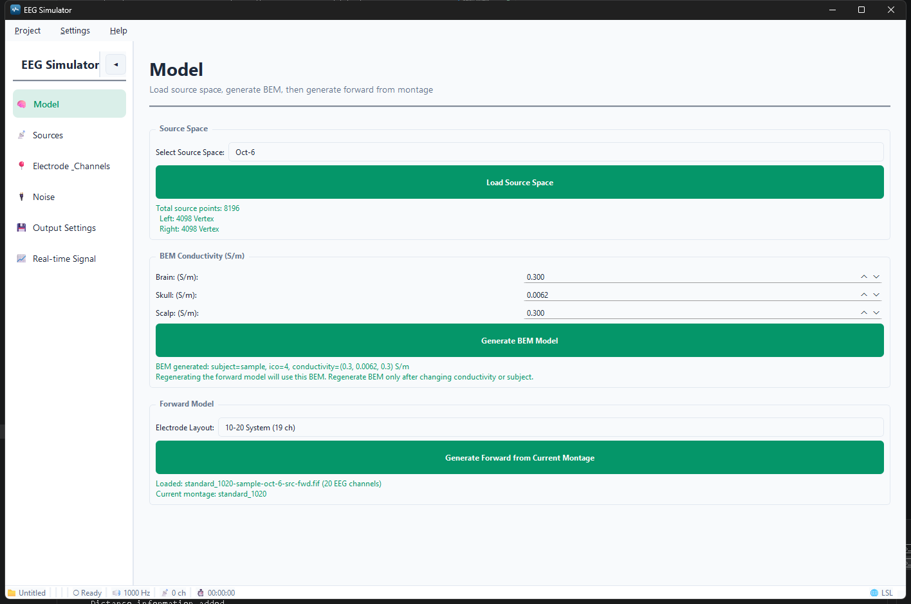
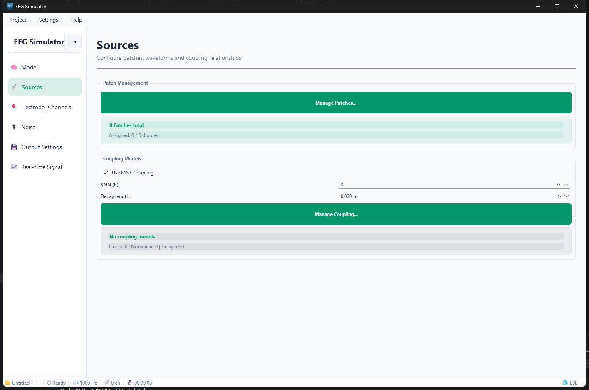
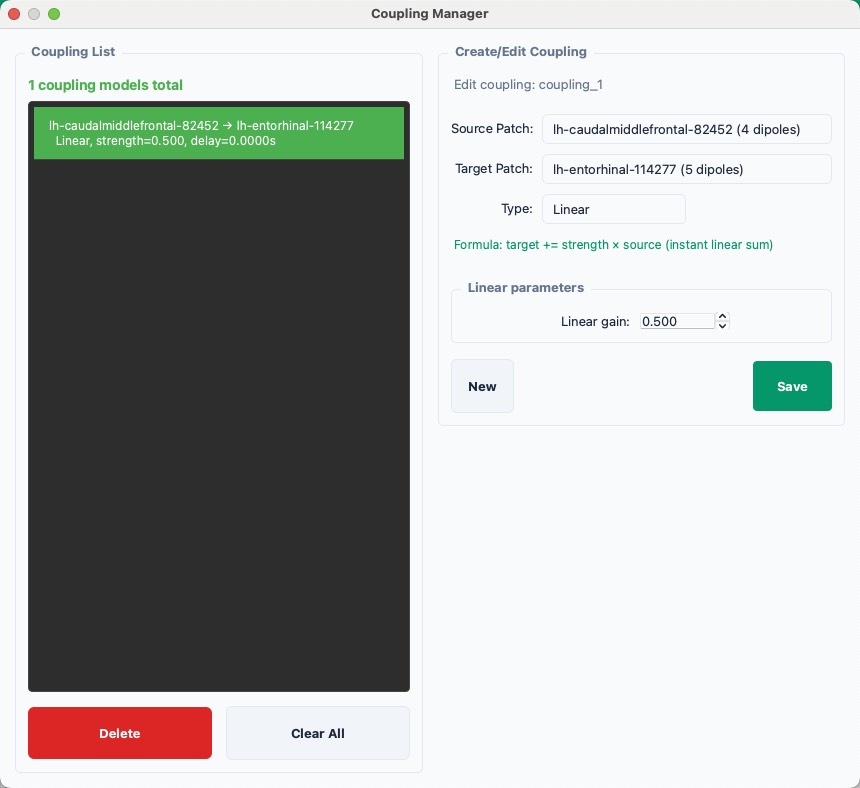
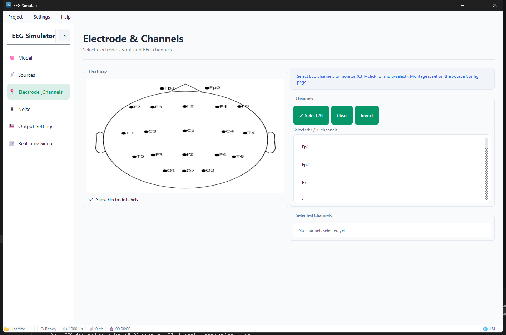
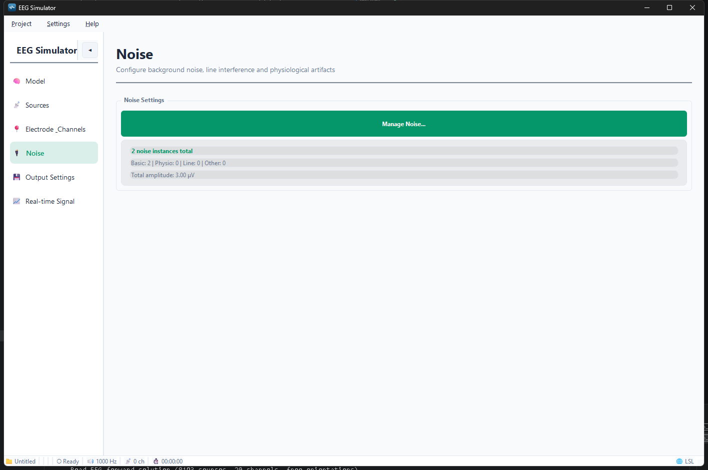
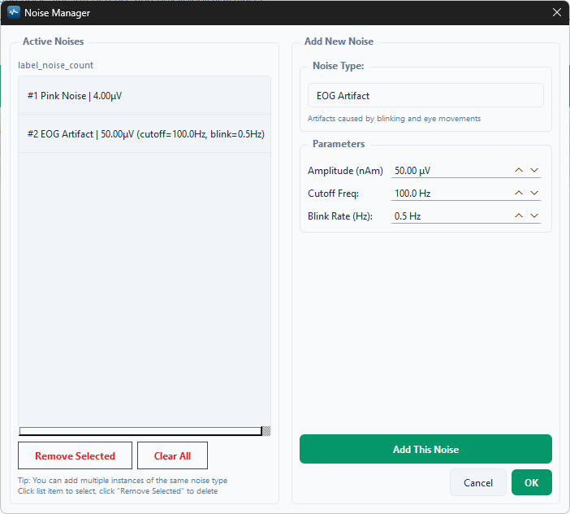
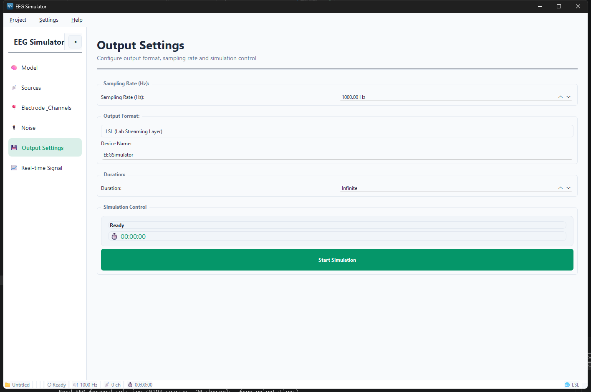
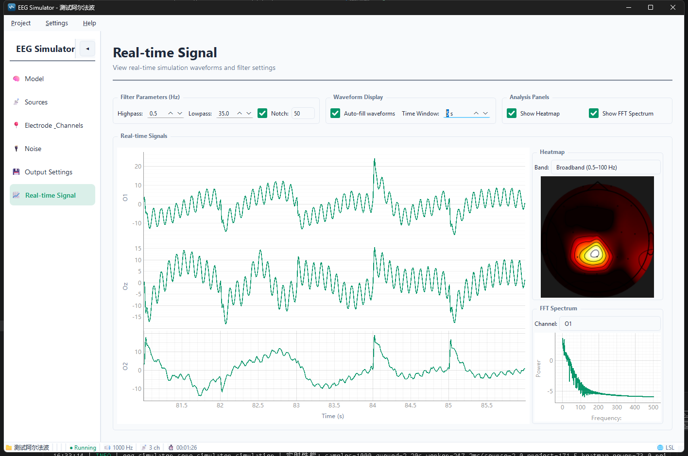

 # EEG Simulator | 脑电信号仿真器

[](https://www.python.org/)
[](https://www.riverbankcomputing.com/software/pyqt/)
[](https://mne.tools/)
[](LICENSE)

EEG Simulator 是一个基于 **PyQt6** 和 **MNE-Python** 的桌面脑电仿真工具。它支持准备解剖模型、配置皮层信号源、设置电极与输出，并以实时方式查看波形、FFT 和头皮地形热力图。

[English Documentation](README.md) | [详细界面文档](docs/README.md)

---

## 功能特性

| 模块 | 说明 |
| --- | --- |
| 模型准备 | 加载 MNE 源空间，配置电极 montage，生成/加载前向模型，可选生成 BEM 模型 |
| 信号源 | 通过偶极子或解剖标签创建 patch，配置正弦、余弦、ERP、高斯、Gamma、振荡包络和自定义波形 |
| 耦合 | 支持线性、非线性、延迟耦合，以及基于 MNE 几何关系的权重 |
| 噪声 | 支持白噪声、粉红噪声、1/f、布朗噪声、工频、EOG、EMG、ECG，可叠加多个实例 |
| 电极与通道 | 选择 montage，并选择参与仿真、输出和显示的通道 |
| 实时显示 | 显示滤波后的多通道波形、FFT 频谱和前向模型地形热力图 |
| 输出 | 支持 LSL 实时流、EDF 文件、FIF 文件，可设置时长限制 |
| 项目管理 | 保存和加载 patch、耦合、噪声、滤波、montage、模型路径和输出配置 |
| 界面 | 支持浅色/深色主题和中英文界面 |

---

## 当前工作流

界面按实际工作流程组织：

```text
模型准备 -> 信号源 -> 电极与通道 -> 噪声 -> 输出 -> 实时信号
```

### 1. 模型准备

模型准备页面用于准备仿真所需的物理模型。

- 加载或创建源空间。
- 配置电极 montage。
- 生成或加载前向模型。
- 如果需要 BEM 流程，可以生成 BEM 模型。
- BEM 生成完成后，按钮下方会显示生成信息。

推荐顺序：

```text
加载源空间 -> 按需要生成/加载 BEM -> 选择 montage -> 生成前向模型
```

如果源空间与前向模型的顶点不完全一致，仿真器会尽量按空间位置将 dipole 吸附到附近有效 forward 顶点，并在日志中输出吸附距离。

<p align="center">
  
</p>

### 2. 信号源

信号源使用 patch 描述皮层活动。

<p align="center">
  
</p>

- 一个 patch 是一组共享波形设置的偶极子。
- patch 可由手动选择的 dipole 创建，也可从解剖标签批量创建。
- 支持正弦、余弦、ERP、高斯、Gamma、瞬态振荡和自定义采样序列。
- patch 幅度单位为 nAm，默认 MNE 源电流换算比例为 `1e-9 A/nAm`。

<p align="center">
  
</p>


### 3. 耦合

patch 之间可以建立耦合关系：

| 类型 | 公式 |
| --- | --- |
| 线性 | `target += strength * source` |
| 非线性 | `target += strength * tanh(source)` |
| 延迟 | `target += strength * source(t-delay)` |
| MNE 权重 | 在可用时根据 patch 几何关系计算权重 |
<p align="center">
  
</p>

### 4. 电极与通道

选择 montage 和仿真通道。montage 会决定前向模型和热力图使用的传感器位置。

<p align="center">
  
</p>

### 5. 噪声

噪声配置已从信号源配置中分离。

<p align="center">
  
</p>

| 类型 | 说明 |
| --- | --- |
| White | 平坦频谱白噪声 |
| Pink | 1/f 粉红噪声 |
| 1/f | 指数可调的分数噪声 |
| Brown | 1/f^2、类似随机游走的低频噪声 |
| Line | 50/60 Hz 工频干扰 |
| EOG | 眨眼和眼动伪迹 |
| EMG | 肌电伪迹 |
| ECG | 心电伪迹 |

当前实现说明：噪声目前按通道独立生成，适合压测去噪算法，但对 EOG、工频等空间相关伪迹还不完全真实。空间相关噪声模型见 [docs/noise_spatial_model_todo.md](docs/noise_spatial_model_todo.md)。

<p align="center">
  
</p>

### 6. 输出

配置采样率、输出格式、输出目录、文件名和仿真时长。

| 格式 | 说明 |
| --- | --- |
| LSL | 通过 Lab Streaming Layer 输出实时流 |
| EDF | 通过 pyEDFlib 导出 EDF 文件 |
| FIF | 导出 MNE 原生 Raw 文件 |

<p align="center">
  
</p>

### 7. 实时信号

实时信号页面显示：

- 多通道滤波波形。
- 高通、低通和 50/60 Hz 陷波滤波。
- 可选 FFT 频谱。
- 可选头皮地形热力图。

当前热力图在存在前向模型时使用 forward 模型中的 EEG 传感器位置，并基于前向投影后的全通道 EEG 计算频带功率。因此它与物理模型保持一致，而不是只使用当前显示的少数通道。

<p align="center">
  
</p>

---

## 实时引擎设计

当前实时引擎将“数据生成”和“界面刷新”分离：

1. 后台 `QThread` 每次生成约 **1 秒** EEG 数据。
2. 生成好的数据块进入内部队列。
3. UI 定时器每帧只消费固定数量的样本：

```text
每帧样本数 = 采样率 / 仿真刷新 FPS
```

例如 `1000 Hz`、`20 FPS` 时，每帧消费约 `50` 个样本。

这样可以避免每次 UI 刷新都调用前向模型，也能在生成成本较高时保持界面响应。

### 性能说明

- 前向投影优先使用稀疏快速路径：只投影活跃 dipole 对应的 forward 矩阵列。
- 如果 forward 结构不适合快速路径，会自动回退到安全的 MNE 兼容路径。
- 波形显示会为了渲染而抽稀，但生成和导出的数据仍保持原始采样率。
- FFT 使用较轻量的实时分析窗口。
- 热力图频带功率在 worker 中基于 forward 投影数据预先计算，UI 只渲染最近结果。
- 慢路径日志会输出 worker、投影、噪声、buffer、绘图和热力图耗时。

示例日志：

```text
实时性能: samples=50 queued=1.20s worker=...ms(source=... project=... heatmap_power=... noise=...) ui=...ms(buffer=... plot=... heatmap=...)
```

---

## 前向模型与热力图行为

存在前向模型时：

- patch dipole 会通过 forward solution 投影到 EEG 传感器。
- 仿真器会将 UI 通道名映射到 forward 模型通道名。
- 如果 dipole 顶点不在 forward 源空间中，会尽量按位置吸附到附近有效 forward 顶点，并记录距离。
- 实时热力图使用 forward 模型中的 EEG 传感器位置。

没有前向模型时：

- 应用会提示当前没有可用前向模型。
- 仿真会使用确定性的简化投影作为回退。
- 简化投影适合界面测试和粗略演示，不适合定量解释。

---

## 项目结构

```text
eeg_simulator/
  core/
    mne_simulator.py          # 前向投影与 MNE 集成
    output_sink.py            # LSL / EDF / FIF 输出
    signal_engine.py          # 波形和噪声生成
    simulator/
      app.py                  # 主窗口状态
      simulation.py           # 实时队列、worker、启停循环
      signal.py               # 投影、滤波、FFT、热力图功率
      buffers.py              # buffer 尺寸和采样率同步
      mne.py                  # 模型生成辅助
      patch_ops.py            # patch、耦合、噪声操作
  models/                     # patch、dipole、耦合和信号模型
  ui/                         # 主题、控件、面板、对话框
  utils/                      # 配置、项目、国际化、日志、MNE 加载
docs/                         # 界面文档
tests/                        # 单元测试
main.py                       # 启动脚本
```

---

## 快速开始

### 环境要求

- Python 3.8+
- Windows、Linux 或 macOS
- 至少 4 GB 内存，推荐 8 GB

### 安装

```bash
git clone <repository-url>
cd eeg-simulator

python -m venv .venv

# Windows
.venv\Scripts\activate

# Linux/macOS
source .venv/bin/activate

pip install -r requirements.txt
python -c "import mne; mne.datasets.sample.data_path()"
```

### 启动

```bash
python main.py

# 或
python -m eeg_simulator
```

---

## 测试

```bash
python -m pytest -q
```

可选脚本：

```bash
python tests/test_compare_mne.py
python tests/test_noise_visualization.py
```

---

## 设置

用户设置保存在 `~/.eegs/config.db`：

- 语言
- 主题
- 默认采样率
- 默认项目目录
- 滤波器阶数
- 热力图刷新间隔

---

## 许可证

[MIT License](LICENSE)

---

## 致谢

- [MNE-Python](https://mne.tools/)
- [PyQt6](https://www.riverbankcomputing.com/software/pyqt/)
- [pyqtgraph](http://www.pyqtgraph.org/)
- [FreeSurfer](https://surfer.nmr.mgh.harvard.edu/)
